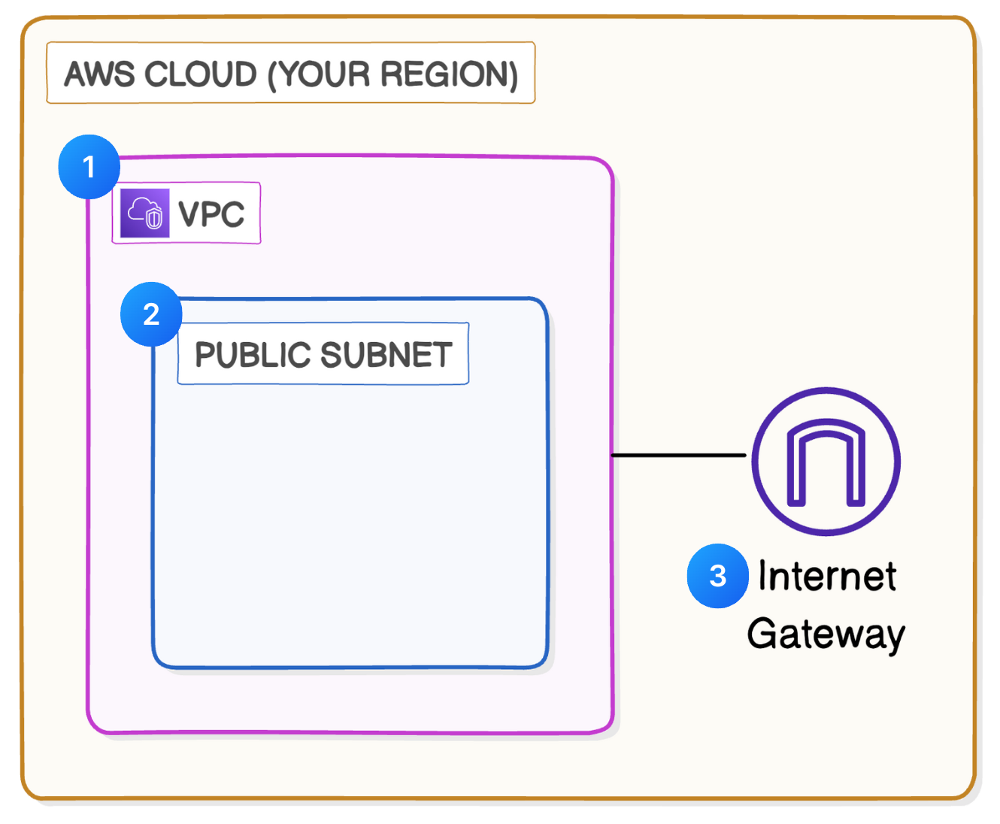

# 🌐 Project 1 – Build a Virtual Private Cloud (VPC)

This project focuses on creating and configuring a **Virtual Private Cloud (VPC)** to understand IP networking and cloud resource isolation inside AWS.

---

## ✅ What I Accomplished

- **Created a Virtual Private Cloud** with a custom IPv4 CIDR block  
- **Set up a public subnet** that auto-assigns public IPs to EC2 instances  
- **Attached an Internet Gateway** to allow internet access for public resources  
- **Updated the route table** to route internet traffic via the IGW

---

## 🧩 Architecture Diagram

Here's the visual of how my VPC is structured:

---

## 📄 Documentation

Check out full setup instructions, configurations, and CLI screenshots in this PDF:  
[📥 VPC Setup Documentation (PDF)](./Documents/VPC-Setup-Documentation.pdf)

---

## 🌟 Key Learnings

> Building a VPC from scratch gave me a solid understanding of network segmentation, routing, and internet access in AWS.

- CIDR block planning and subnet creation  
- Internet Gateway setup and route table configuration  
- Concepts like public IP auto-assign, default VPC vs custom VPC

---

## 🙏 Credits

Big thanks to **NextWork** for providing this amazing hands-on project.  
Explore more [here](https://link.nextwork.org/linkedin)

---

## 🔖 Tags

`#AWS` `#CloudComputing` `#AmazonVPC` `#Networking`  
`#AWSBeginnersChallenge` `#NextWork`
