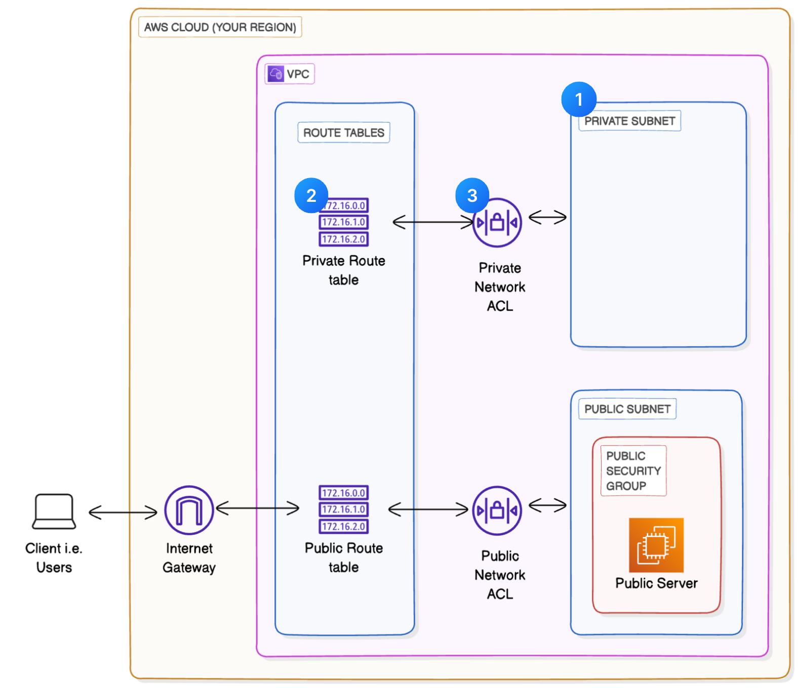

# 🔒 Project 3 – Creating a Private Subnet

This project focused on isolating resources in a **private subnet** within an Amazon VPC to enhance security and restrict public internet access.

---

## ✅ What I Accomplished

- **Created a private subnet** within the VPC  
- Ensured **CIDR block isolation** to avoid conflicts with public subnets  
- Configured a **dedicated route table** without routes to an Internet Gateway  
- Set up a **Network ACL** that denies all inbound and outbound traffic by default  

---

## 🧩 Architecture Diagram

---

## 📄 Documentation

Full setup steps, configurations, and CLI screenshots can be found here:  
[📥 Private Subnet Documentation (PDF)](./Documents/Private-Subnet-Documentation.pdf)

---

## 🌟 Key Learnings

> Building a private subnet helped me understand network isolation and security best practices in AWS.

- Subnet CIDR planning for public vs private  
- Route table management for controlled traffic flow  
- Network ACLs to enforce subnet-level security

---

## 🙏 Credits

Thanks to **NextWork** for the detailed guides and support.  
Explore more [here](https://link.nextwork.org/linkedin)

---

## 🔖 Tags

`#AWS` `#CloudComputing` `#NetworkSecurity` `#AmazonVPC` `#EC2`  
`#CloudNetworking` `#AWSBeginnersChallenge` `#NextWork`
