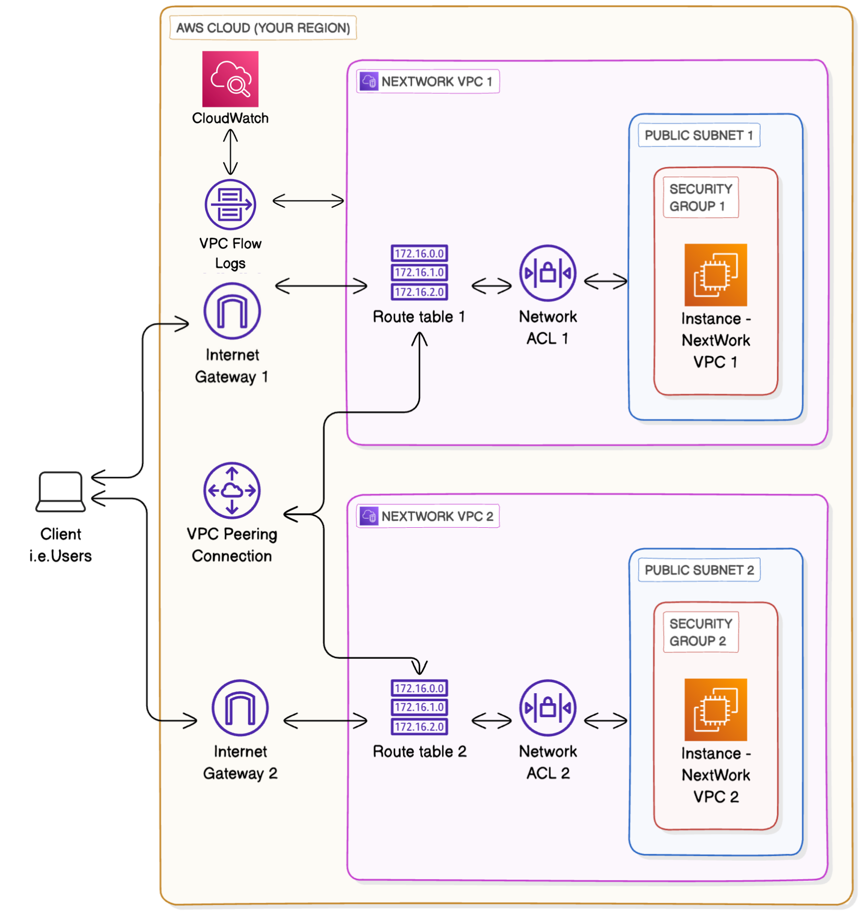

# VPC Monitoring with Flow Logs

## Description

This project demonstrates how to monitor network traffic within an Amazon Virtual Private Cloud (VPC) using VPC Flow Logs. You will create two VPCs, launch EC2 instances in each, set up a VPC peering connection, and then enable flow logs to capture and analyze IP traffic. The goal is to learn how network engineers track traffic patterns, debug connectivity issues, and detect security threats.

### Architecture Overview

| Component | Details |
|-----------|---------|
| VPC 1 | NextWork-1 — CIDR: `10.1.0.0/16` |
| VPC 2 | NextWork-2 — CIDR: `10.2.0.0/16` |
| Subnets | 1 public subnet per VPC |
| EC2 Instances | 1 per subnet, ICMP (ping) enabled |
| Peering | VPC1 ↔ VPC2 peering connection |
| Flow Logs | Published to CloudWatch Logs group |
| IAM | Role + policy for Flow Logs → CloudWatch |
| Analysis | CloudWatch Logs Insights queries |

- Architecture Diagram



---
## 📄 Documentation

[📥 Project 7 – VPC-Monitoring-with-Flow-Logs (PDF)](./Documents/VPC-Monitoring-with-Flow-Logs.pdf)

## Prerequisites

- An AWS account with permissions to create VPCs, EC2 instances, IAM roles, and CloudWatch log groups.
- Basic understanding of VPCs, subnets, route tables, and security groups.

---

## Project Steps

### 1. Create Two VPCs Using the VPC Wizard

**VPC 1 — NextWork-1**

| Setting | Value |
|---------|-------|
| Name tag | `NextWork-1` |
| IPv4 CIDR | `10.1.0.0/16` |
| IPv6 | No IPv6 CIDR block |
| Tenancy | Default |
| Availability Zones | 1 |
| Public subnets | 1 |
| Private subnets | 0 |
| NAT gateways | None |
| VPC endpoints | None |

**VPC 2 — NextWork-2**

Same as VPC 1 except:

| Setting | Value |
|---------|-------|
| Name tag | `NextWork-2` |
| IPv4 CIDR | `10.2.0.0/16` |

> The CIDR blocks must be unique to avoid routing conflicts.

---

### 2. Launch EC2 Instances

Launch one EC2 instance in each VPC's public subnet.

**Instance in VPC 1**

| Setting | Value |
|---------|-------|
| VPC | `NextWork-1` |
| Subnet | Public subnet of VPC 1 |
| Auto-assign public IP | Enable (required for EC2 Instance Connect) |
| Security group | `NextWork-1-SG` (create new) |
| Security group rule | All ICMP IPv4 from source `0.0.0.0/0` |

**Instance in VPC 2**

| Setting | Value |
|---------|-------|
| VPC | `NextWork-2` |
| Subnet | Public subnet of VPC 2 |
| Auto-assign public IP | Enable |
| Security group | `NextWork-2-SG` |
| Security group rule | All ICMP IPv4 from source `0.0.0.0/0` |

---

### 3. Set Up VPC Flow Logs

Flow logs capture IP traffic information. To store logs, create a CloudWatch Logs group and an IAM role that gives Flow Logs permission to write logs.

#### 3a. Create IAM Policy

Navigate to **IAM → Policies → Create policy** and use the following JSON:

```json
{
  "Version": "2012-10-17",
  "Statement": [
    {
      "Effect": "Allow",
      "Action": [
        "logs:CreateLogGroup",
        "logs:CreateLogStream",
        "logs:PutLogEvents",
        "logs:DescribeLogGroups",
        "logs:DescribeLogStreams"
      ],
      "Resource": "*"
    }
  ]
}
```

Name the policy (e.g., `VPCFlowLogsPolicy`).

#### 3b. Create IAM Role with Custom Trust Policy

1. Go to **IAM → Roles → Create role**.
2. Trusted entity type: **Custom trust policy**.
3. Replace `"Principal": {}` with:

```json
"Principal": {
  "Service": "vpc-flow-logs.amazonaws.com"
}
```

4. Attach the policy created above.
5. Name the role (e.g., `VPCFlowLogsRole`).

#### 3c. Create Flow Logs for the Subnets

1. In the VPC console, go to **Subnets**.
2. Select the public subnet of VPC 1.
3. **Actions → Create flow log** with the following settings:

| Setting | Value |
|---------|-------|
| Destination | Send to CloudWatch Logs |
| Destination log group | Create new — e.g., `NextWorkVPCFlowLogsGroup` |
| IAM role | `VPCFlowLogsRole` |

4. Repeat for the public subnet of VPC 2.

---

### 4. Create VPC Peering Connection

1. In the VPC console, go to **Peering Connections → Create peering connection**.

| Setting | Value |
|---------|-------|
| Name | `VPC1-VPC2-Peering` |
| VPC (Requester) | `NextWork-1` |
| VPC (Accepter) | `NextWork-2` (same or different account) |

2. Create the connection, then **accept the request**.

---

### 5. Update Route Tables

Each VPC needs a route that sends traffic to the other VPC through the peering connection.

**VPC 1 Route Table**

1. Go to **Route Tables → Select `NextWork-1-rtb-public`**.
2. **Routes tab → Edit routes → Add route:**

| Setting | Value |
|---------|-------|
| Destination | `10.2.0.0/16` |
| Target | Peering Connection `VPC1-VPC2-Peering` |

**VPC 2 Route Table**

1. Select `NextWork-2-rtb-public`.
2. **Add route:**

| Setting | Value |
|---------|-------|
| Destination | `10.1.0.0/16` |
| Target | Same peering connection |

---

### 6. Test the Peering Connection

1. Use **EC2 Instance Connect** to connect to the instance in VPC 1.
2. Run a ping test to the **private IP address** of the instance in VPC 2:

```bash
ping <private-ip-of-vpc2-instance>
```

Successful ping replies confirm the peering connection is working and traffic is flowing over private IPs.

---

### 7. Analyze Flow Logs with CloudWatch Logs Insights

1. Go to **CloudWatch → Logs Insights**.
2. Select the log group `NextWorkVPCFlowLogsGroup`.
3. Run the sample query: **"Top 10 byte transfers by source and destination IP addresses"**.
4. Review results to identify which IP pairs transferred the most data.

---

## Understanding Flow Log Entries

A typical flow log entry includes:

| Field | Description |
|-------|-------------|
| Source IP | Origin of the traffic |
| Destination IP | Target of the traffic |
| Bytes | Number of bytes transferred |
| Packets | Number of packets sent |
| Protocol | TCP, ICMP, UDP, etc. |
| Port | Port number used |
| Action | `ACCEPT` or `REJECT` |

**Example entry:**
```
... 344 bytes ... 4 packets ... TCP ... port 22 ... ACCEPT
```

---

## Key Takeaways

- **VPC Flow Logs** monitor network traffic without affecting performance.
- **IAM roles and trust policies** are required to grant Flow Logs permission to publish to CloudWatch.
- **VPC peering** requires explicit routes in route tables to direct traffic between VPCs.
- **CloudWatch Logs Insights** enables powerful queries to analyze traffic patterns at scale.
- **Network monitoring** is essential for troubleshooting, security, and optimization.

---

## Clean Up

To avoid ongoing AWS charges, delete the following resources in order:

1. EC2 instances
2. VPC peering connection
3. Flow logs
4. CloudWatch log group (`NextWorkVPCFlowLogsGroup`)
5. IAM role (`VPCFlowLogsRole`) and policy (`VPCFlowLogsPolicy`)
6. Both VPCs (`NextWork-1`, `NextWork-2`)

---


- [AWS VPC Flow Logs Documentation](https://docs.aws.amazon.com/vpc/latest/userguide/flow-logs.html)
- [AWS VPC Peering Guide](https://docs.aws.amazon.com/vpc/latest/peering/what-is-vpc-peering.html)
- [CloudWatch Logs Insights Query Syntax](https://docs.aws.amazon.com/AmazonCloudWatch/latest/logs/CWL_QuerySyntax.html)
