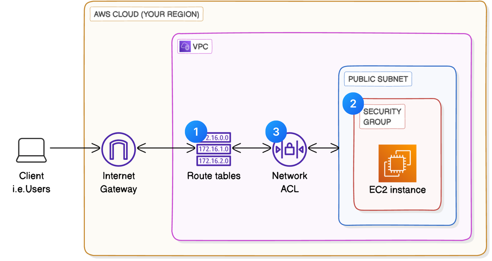
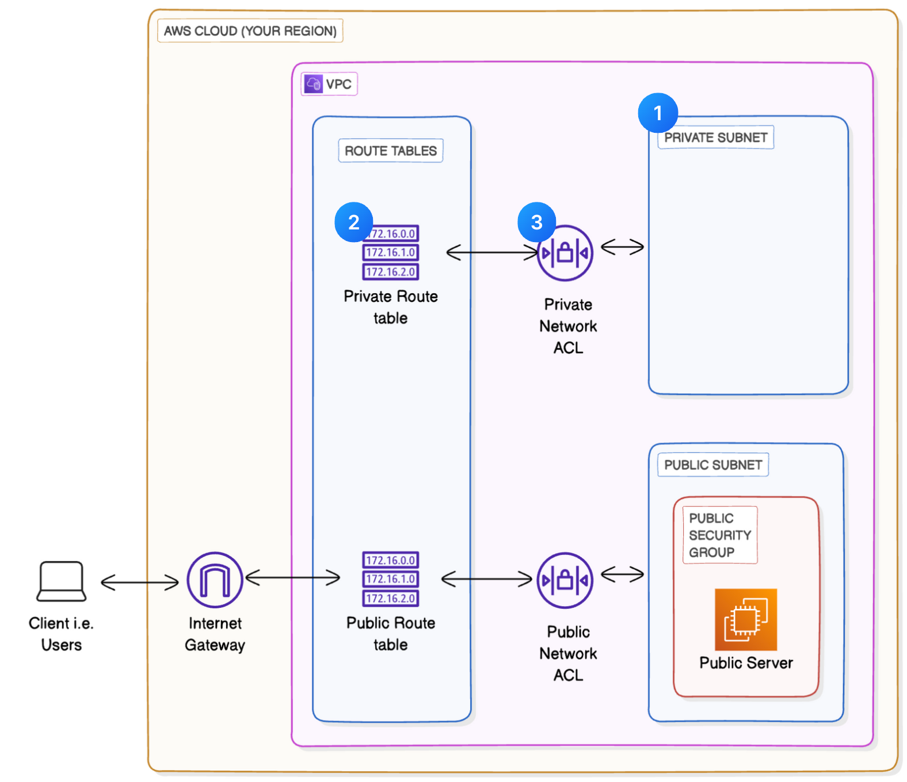
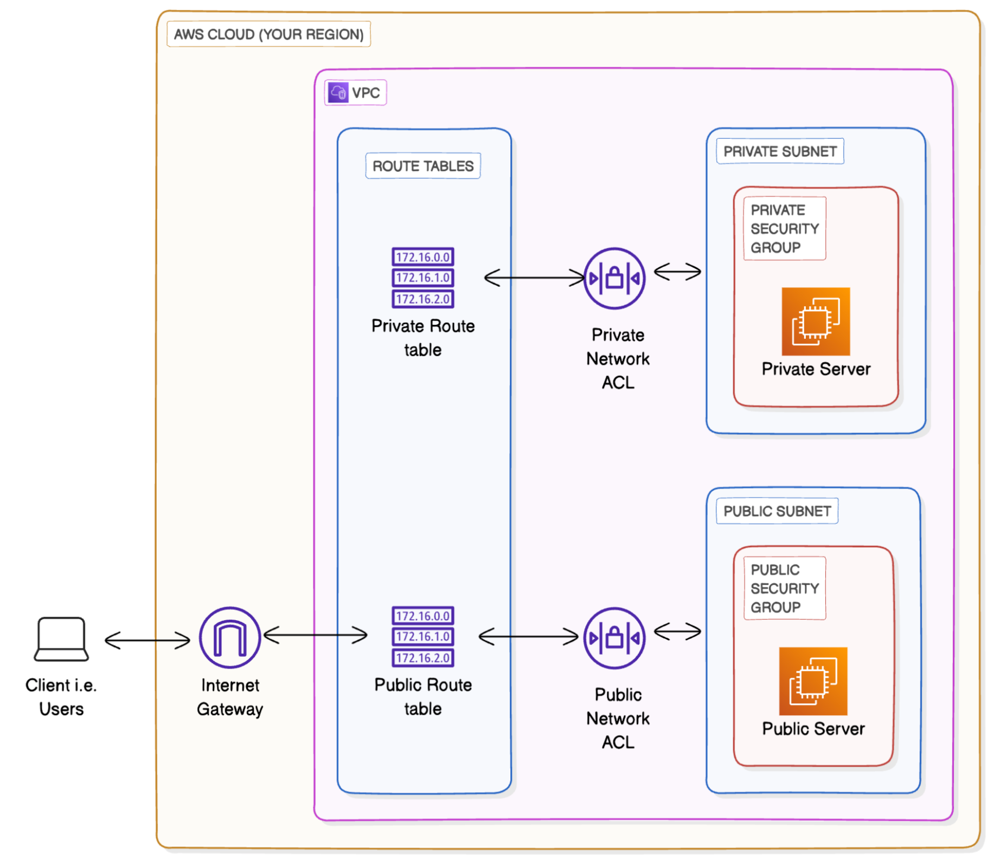
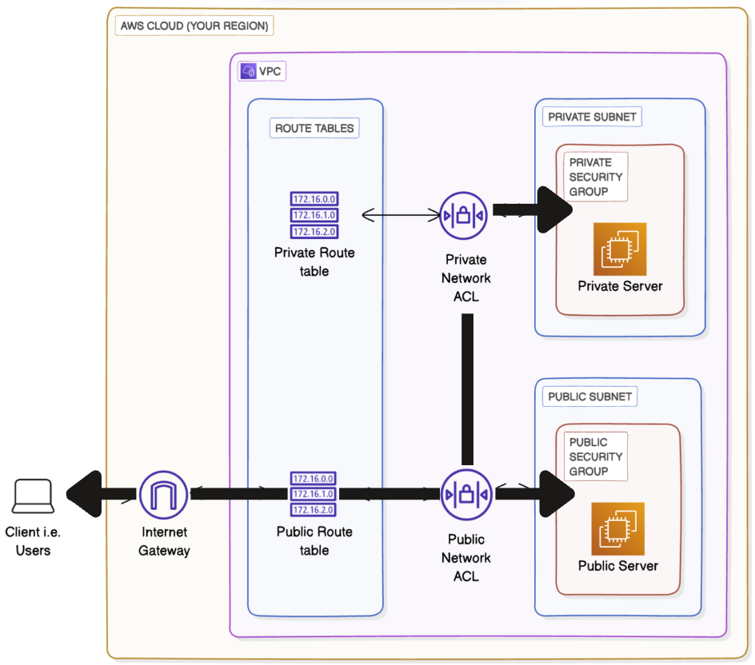
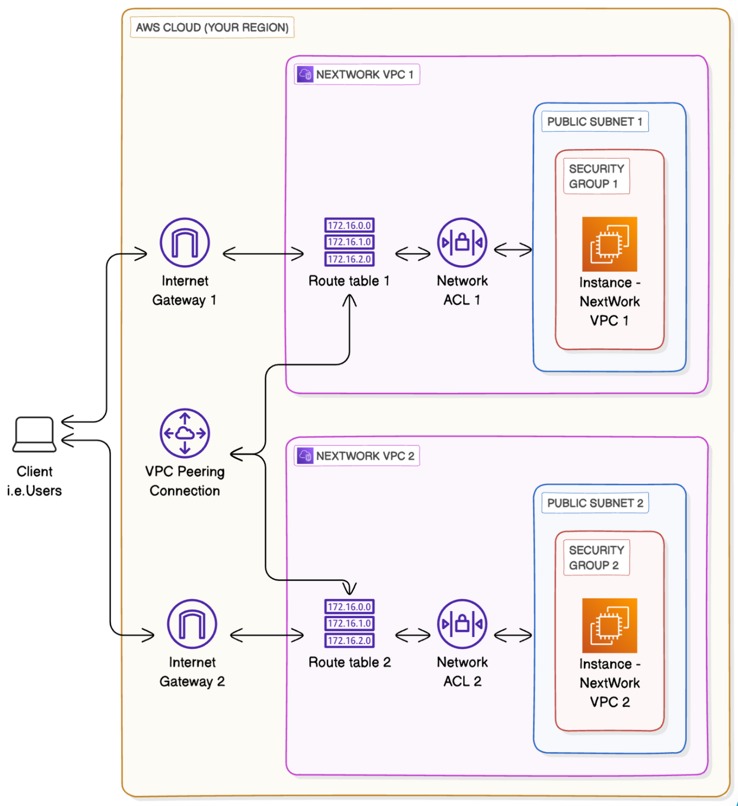

# 🌐 AWS Cloud Networking Projects

This repository contains a structured series of AWS networking projects — from building VPCs to advanced topics like flow logs, endpoints, and VPC peering.

---

## ✅ Completed Projects

✅ **[Project 1 – Build a Virtual Private Cloud](./Project-1-Virtual-Private-Cloud)**  
- Created a custom VPC with a public subnet and internet access.  
- Learned IP addressing, routing, and gateway setup.  
- 📄 [View Documentation PDF](./Project-1-Virtual-Private-Cloud/Documents/VPC-Setup-Documentation.pdf)
- Architecture Diagram

✅ **[Project 2 – VPC Traffic Flow and Security](./Project-2-VPC-Traffic-and-Security)**  
- Configured route tables, security groups, and network ACLs.  
- Secured traffic flow and controlled access to AWS resources.  
- 📄 [View Documentation PDF](./Project-2-VPC-Traffic-and-Security/Documents/VPC-Traffic-Security-Documentation.pdf)
- Architecture Diagram
  

✅ **[Project 3 – Creating a Private Subnet](./Project-3-Private-Subnet)**  
- Created an isolated private subnet with no internet access.  
- Set up route tables and ACLs to secure subnet traffic.  
- 📄 [View Documentation PDF](./Project-3-Private-Subnet/Documents/Private-Subnet-Documentation1.pdf)
- Architecture Diagram
  

✅ **[Project 4 – Launching VPC & EC2 Instances](./Project-4-Launching-VPC-Resources)**  
- Launched public and private EC2 instances inside a custom VPC.  
- Configured security groups for controlled internal access.  
- 📄 [View Documentation PDF](./Project-4-Launching-VPC-Resources/Documents/launching-vpc-resources.pdf)
- Architecture Diagram
  

✅ **[Project 5 – Testing VPC Connectivity](./Project-5-Testing-VPC-Connectivity)**  
- Tested SSH, ping, and curl to validate VPC routing and security rules.  
- Troubleshot missing inbound rules and ICMP blocks.  
- 📄 [View Documentation PDF](./Project-5-Testing-VPC-Connectivity/Documents/Testing-VPC-Connectivity.pdf)
- Architecture Diagram
  

✅ **[Project 6 – VPC Peering](./Project-6-VPC-Peering)**  
- Connected two VPCs using a peering connection and updated route tables.  
- Tested cross‑VPC communication with ping and Elastic IPs.  
- 📄 [View Documentation PDF](./Project-6-VPC-Peering/Documents/VPC-Peering.pdf)
- Architecture Diagram
  

✅ **[Project 7 – VPC Monitoring with Flow Logs](./Project-7-VPC-Monitoring-with-Flow-Logs)**
- Created two VPCs with public subnets and EC2 instances, enabled ICMP for ping tests.
- Set up VPC peering, updated route tables, and verified private IP communication.
- Configured VPC Flow Logs to CloudWatch Logs with a custom IAM role and policy.
- Analyzed network traffic using CloudWatch Logs Insights queries (e.g., top byte transfers).
- 📄 [View Documentation PDF](./Project-7-VPC-Monitoring-with-Flow-Logs/Documents/VPC-Flow-Logs.pdf)
- Architecture Diagram
  

---

## 🔄 Upcoming Projects

🔄 **Project 8 – Access S3 from a VPC**  
🔄 **Project 9 – VPC Endpoints**

---

## 🙏 Special Thanks

Thanks to **NextWork** for curating this fantastic hands-on AWS challenge.  
👉 [Learn more here](https://link.nextwork.org/linkedin)

---

## 🔖 Tags

#AWS #CloudNetworking #AmazonVPC #SecurityGroups  
#AWSBeginnersChallenge #NextWork #NetworkingProjects
